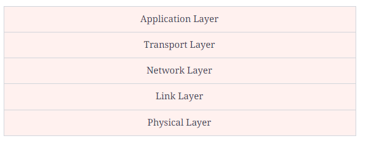
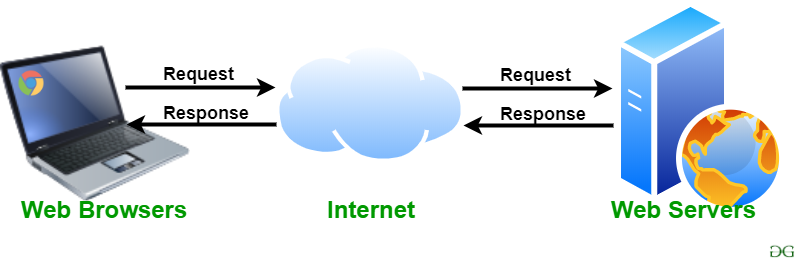
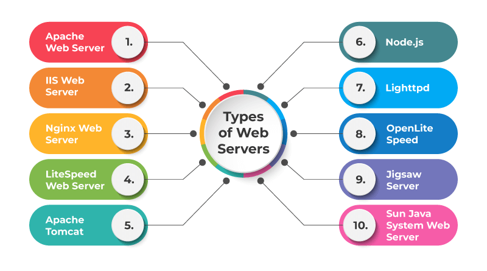
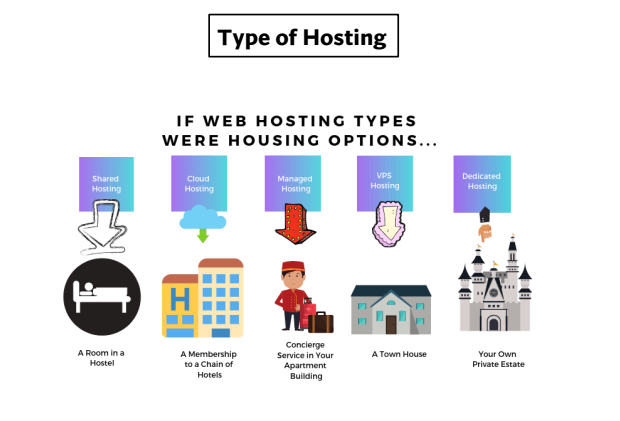

# Solutions For Week-1 Assignments!

### 1.What is a protocol stack, and how is it used in web development?

* The protocol stack is a set of communication protocols used to transmit data over a network

* There are five layers in the internet protocol stack, as shown in the table below:

* While sending a message, the message travels through each layer one by one, starting from the application layer. Each layer adds its own relevant
 information to the data packet. The packet travels through each layer on the receiving end one by one, starting at the physical layer. Each layer extracts the relevant information, and finally, the message reaches the application layer.

 ### Application layer

 * As suggested by its name, the application layer is responsible for communication between applications running on two different end systems. A message or data transferred from one end is readable for the corresponding application on the other end. These applications include web browsers, email clients, etc.

 * At the application layer, the data being transferred is called a message.

 * The protocols used at the application layer include:

* Hypertext Transfer Protocol (HTTP): for transferring HTML web documents
File Transfer Protocol (FTP): for transferring files
Simple Mail Transfer Protocol (SMTP): for transferring e-mail messages
Domain Name System (DNS): for translation of human-friendly domain names into IP addresses

### Transport layer

* On the sending end, the transport layer is responsible for collecting the application layer message from the relevant end-point and transferring it to the network layer to be communicated over the network. The receiving end collects the message from the network layer and passes it on to the relevant end-point where the application layer can access that message.

* These end-points are called sockets. The transport layer uses a unique identifier called a port number to identify the correct socket or application.

* The message received from the application layer might be broken into chunks at this layer.

* The transport layers add a header with its own information on top of the message received from the application layer. The unit of data at the transport layer is called a segment.

* The two important protocols used in the transport layer are:

* Transmission Control Protocol (TCP): for reliable and connection-oriented data transfer
User Datagram Protocol (UDP): for fast, unreliable, and connection-less data transfer
Connection-oriented means that TCP establishes the connection first and then transmits the data. On the other hand, UDP is connection-less, which means that it just sends the data without checking if it is being received or not.

### Network layer

* The network layer is responsible for transferring data from one system to another on the network. The transport layer passes a segment and the destination address to the network layer. Then, it is the responsibility of the network layer to transfer the data to the destination end-system over the network. This layer also takes care of the routing of data on intermediate routers.

* The network layer adds a header and a trailer with its information on top of the packet received by the transport layer. The data packet at the network layer is called a datagram.

* The main protocol used at the network layer to transfer data is Internet Protocol (IP). This protocol makes use of IP addresses to identify each system connected to the internet. The two versions of IP protocol are as follows:

* IPv4: widely used protocol for communication over the internet and uses a 32-bit IP address
IPv6: proposed to replace IPv4 with the IP addresses of 128-bits because 32-bit IP addresses will be insufficient with the high number of computers being connected to the internet
Another protocol used at this layer for error-reporting is the Internet Control Message Protocol (ICMP). ICMP requests the sender to resend the data if the data is not received or received in the wrong order on the other end. It is simply a protocol that transfers information about the data, not the data itself. It is different from IPv4 or IPv6 as it does not rely on TCP or UDP. It does not ensure a reliable connection before sending a message.

* Commands like ping and traceroute make use of ICMP.

###  Link layer

* When a packet is being transferred over the internet, several intermediate devices are between the two end systems. These devices may be routers, switches, or other computers. The link layer is responsible for communication between one device and its immediate neighbor.

* The protocols and methods used for one link might differ from the protocol used in the next immediate link, even if the destination and data packet remain the same.

* The link layer adds a header with its information on top of the packet it receives from the network layer. The data packet at the link layer is called a frame.

* The link-layer is mostly implemented in the network adapter/network interface card (NIC), and technologies like ethernet, Wi-Fi, token ring, etc., are associated with the link layer.

### Physical layer

* The physical layer is responsible for breaking the data frame into bits, converting it into a form that can be transmitted over the physical communication line, and transferring it. This form could be light pulses (fiber-optic), radio waves (for wireless communication, or electric pulses (for wired communication).

* On the receiving end, the physical layer collects the stream of bits and reassembles it into a data frame that is then passed onto the link layer for further processing.

* The protocols and rules used at this layer are dependent on the kind of communication medium being used. For example, ethernet (link layer protocol) has different physical layer protocols for twisted-pair cable, coaxial cable, and fiber optic cable.

### 2.What are the different types of web servers, and how do they differ in terms of functionality and performance

* Web Server: Web server is a program which processes the network requests of the users and serves them with files that create web pages. This exchange takes place using Hypertext Transfer Protocol (HTTP).
Basically, web servers are computers used to store HTTP files which makes a website and when a client requests a certain website, it delivers the requested website to the client. For example, you want to open Facebook on your laptop and enter the URL in the search bar of google.

* Type of Webserver 

### 3.What is web hosting, and what are the different types of hosting services available for websites?

* Web Hosting 
    * Web hosting is an online service that makes your website's content accessible on the internet. When you purchase a hosting plan, you are renting space on a physical server to store all the website's files and data.

* Different types of Hosting Services 

        

### 4.What is scaling, and why is it important for web applications? How does scaling differ for vertical and horizontal scaling?

* Scaling 
     * Cloud scalability in cloud computing refers to the ability to increase or decrease IT resources as needed to meet changing demand.

* Why Scaling is important?     
     * Scalability is one of the driving reasons to migrate to the cloud. Whether traffic or workload demands increase suddenly or grow gradually over time, a scalable cloud solution enables organizations to respond appropriately and cost-effectively to increase storage and performance.

* Difference between vertical and horizontal scaling?

     * The primary difference between horizontal scaling and vertical scaling is that horizontal scaling involves adding more machines or nodes to a system, while vertical scaling involves adding more power (CPU, RAM, storage, etc.) to an existing machine.

### 5.What is SEO (Search Engine Optimization), and how can web developers optimize their websites for better search engine rankings?
   
   * SEO stands for “search engine optimization.” In simple terms, SEO means the process of improving your website to increase its visibility in Google, Microsoft Bing, and other search engines

   * how can web developers optimize their websites
      * 1. Target The Right Keywords
      * 2. Create New Content
      * 3. Optimise Your META Tags
      * 4. Check on Your Page Load Time
      * 5. Make Your Website Responsive
      * 6. Review Your Competitors Websites

     
