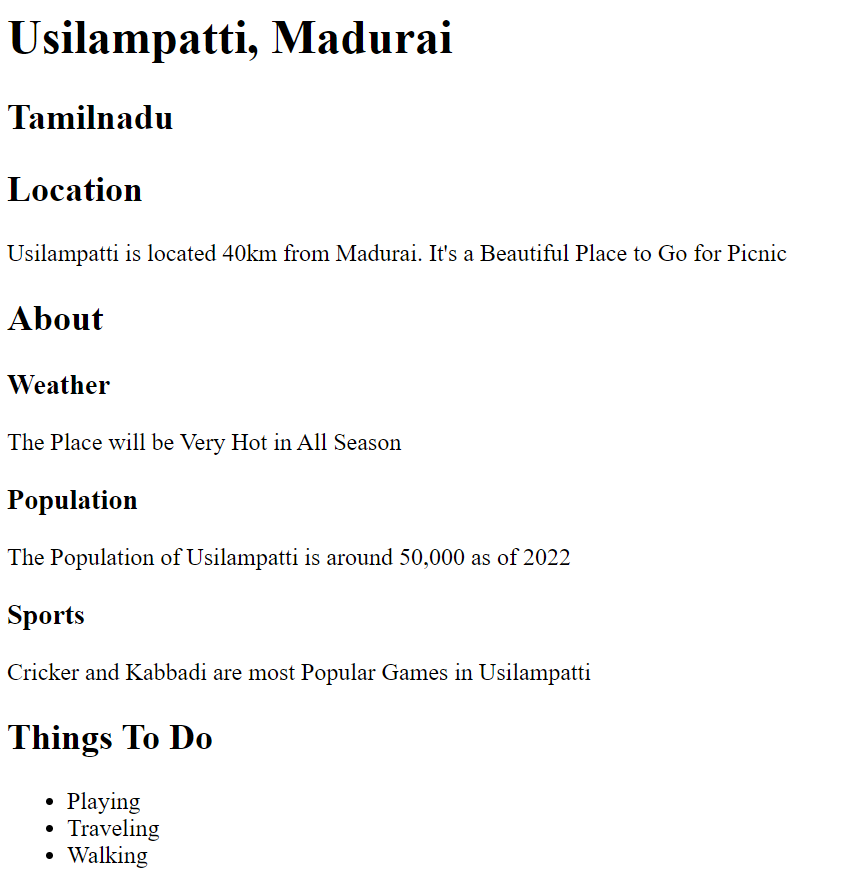

# Week-2 Assignment-2

Hometown Webpage
Please Complete Below assignment and upload github link of that solution after completion
Create a webpage about your hometown like the example below.


Hometown Name

Location

A brief description of the town's location goes here.

About

Subsection 1

A paragraph describing something about the hometown goes here.

Subsection 2

A paragraph describing something else about the hometown goes here.

Subsection 3

A paragraph describing another aspect of the hometown goes here.

Things To Do

Visit the historic landmarks.

Explore the beautiful parks and nature reserves.

Try out the local cuisine and restaurants.

```
Solution For Above Question is Under index.html
```
### Preview of the Solution 

