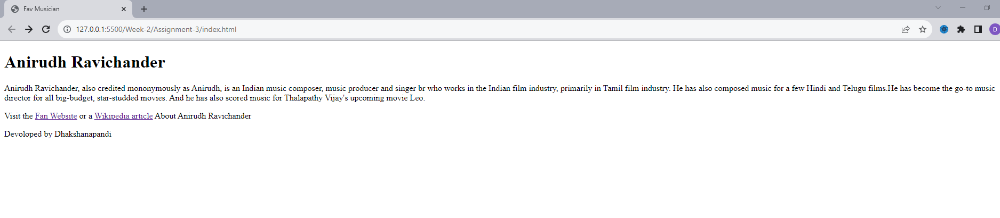

# Week-2 Assignment-3

Your Favorite Musician Fan Webpage
Please Complete Below assignment and upload github link of that solution after completion
Create a webpage in a file called index.html about one of your favorite musicians, similar to the example below.


Use the following HTML containers:

"header" with "h1" tags that contain the musician's name

"main" with 2 paragraphs:

1st paragraph gives some background information

2nd paragraph links to at least one website about the musician
that names the webpage's creator

```
Solution For Above Question is Under index.html
```
### Preview of the Solution 

