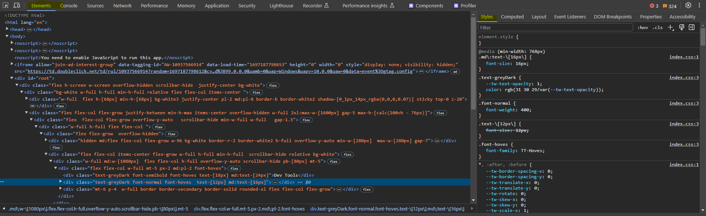
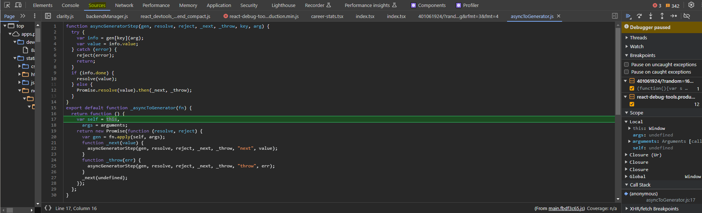
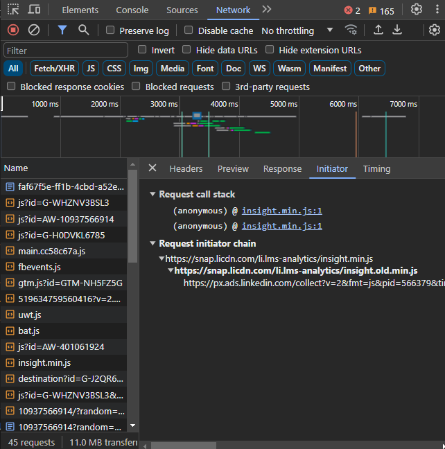
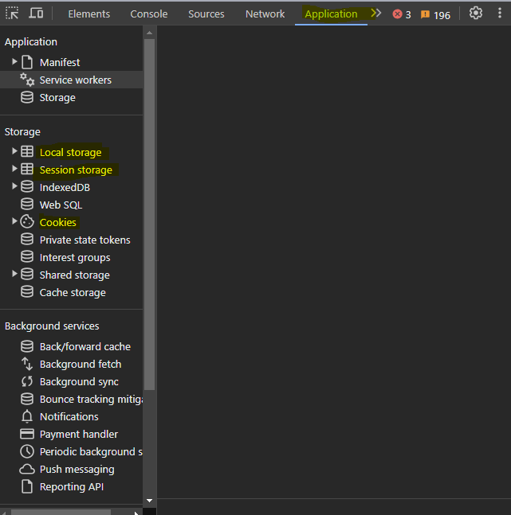
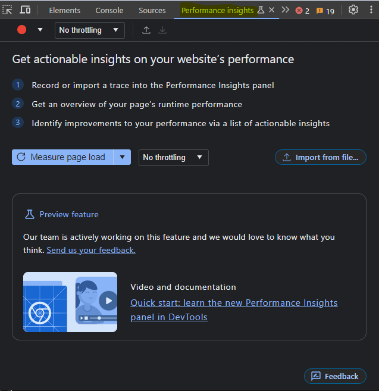
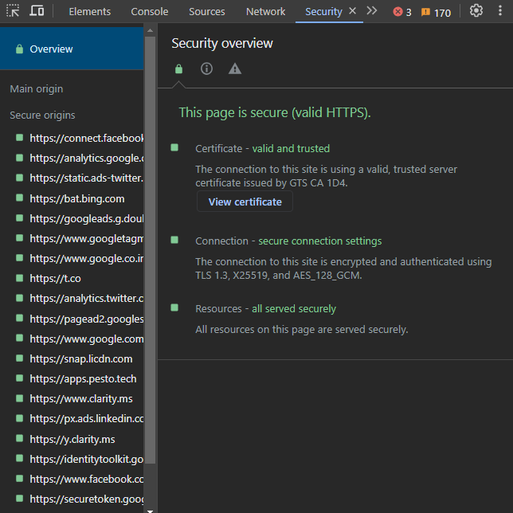
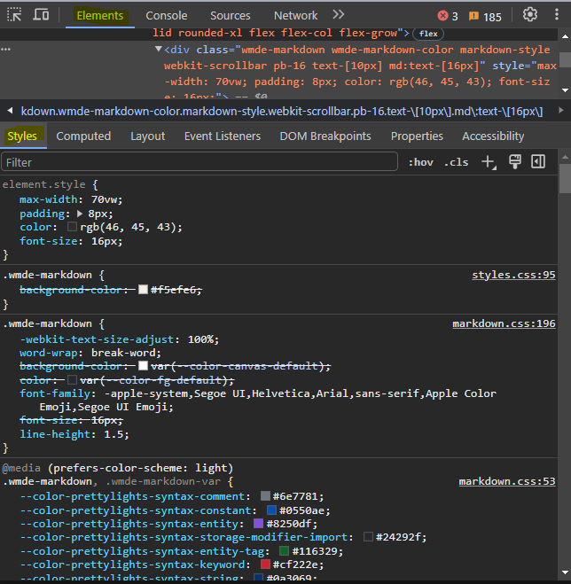
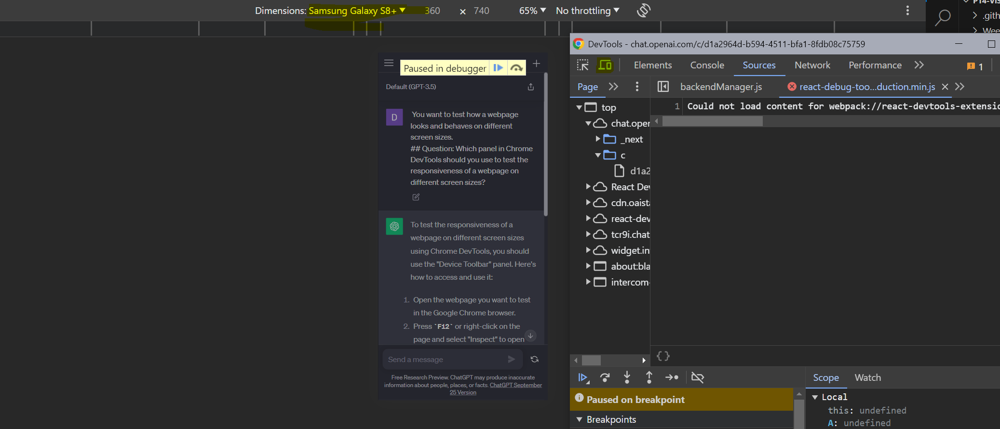

# Situation: You want to inspect the HTML and CSS code of a webpage.
## Question: Which panel in Chrome DevTools should you use to inspect the DOM and CSS of a webpage?
### Elements Tab is used to inspect The HTMl and CSS code of a Webpage

# Situation: You suspect that a particular JavaScript function is causing errors on a webpage.
## Question: Which panel in Chrome DevTools should you use to debug the JavaScript code on a webpage?
### I will use Source Tab in DevTool and identify Particular js File and i'll add breakpoint and try to fix the issue with the help of debugger 

# Situation: You want to analyze the network traffic of a webpage and find out which requests are taking the longest time to load.
## Question: Which panel in Chrome DevTools should you use to analyze the network requests and responses of a webpage?
### i will use Network tab to analyze the network traffic 

# Situation: You want to inspect and manipulate browser storage, such as cookies and local storage.
## Question: Which panel in Chrome DevTools should you use to inspect and manipulate browser storage on a webpage?
### Application Tab is used to inspect and manipulate browser storage , such as cookies and local storage and session storage

# Situation: You want to optimize the performance of a webpage and identify potential bottlenecks.
## Question: Which panel in Chrome DevTools should you use to analyze the performance of a webpage and identify potential bottlenecks?
###  Performance Insights Tab is used to identify areas of the website that may be causing slowdowns and to optimize the performance of the page

# Situation: You want to test the security of a webpage and check if it has any vulnerabilities.
## Question: Which panel in Chrome DevTools should you use to analyze the security of a webpage and identify potential vulnerabilities?
### Security Tab is used to test the Security

# Situation: You want to view and modify the CSS styles of a webpage in real-time.
## Question: Which panel in Chrome DevTools should you use to view and modify the CSS styles of a webpage in real-time?
### Under Elements Tab Style Tab is used to view and modify the CSS Style of a webpage in real-time

# Situation: You want to test how a webpage looks and behaves on different screen sizes.
## Question: Which panel in Chrome DevTools should you use to test the responsiveness of a webpage on different screen sizes?
### In DevTools, you'll see a set of tabs at the top. Look for the one called "Toggle Device Toolbar" or "Toggle Device Mode." It typically looks like a small mobile or tablet icon.

