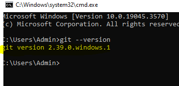
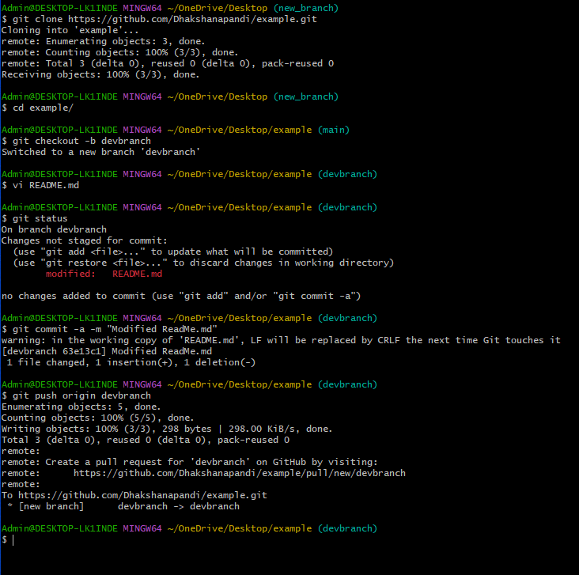
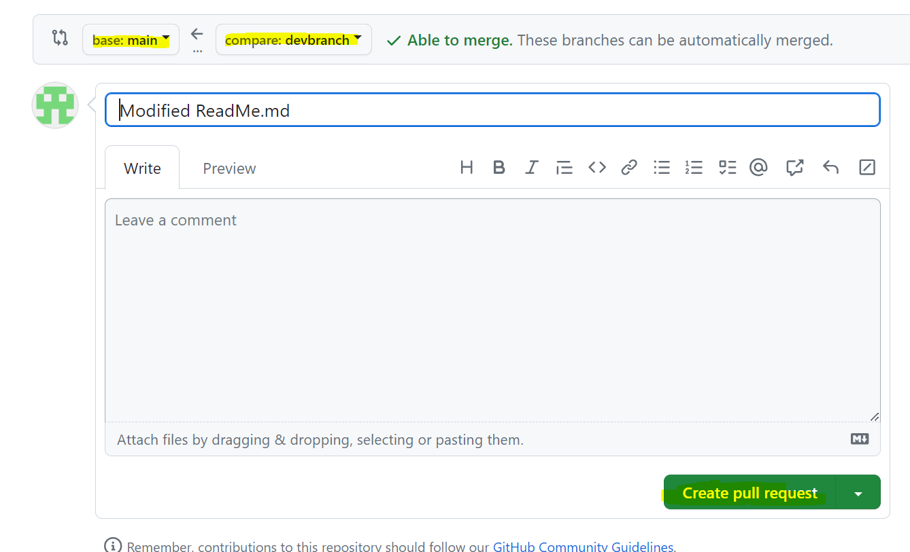

## Activity 1: Install git and play with a repository
https://git-scm.com/book/en/v2/Getting-Started-Installing-Git
Add a README.md (info about your repository for anyone to read) or any other file
Commit the file

## Activity 2: Make a GitHub account and push your local repo to GitHub

## Final Activity - Make a PR to main branch
Make a pull request to the repository below with your name and GitHub info in the README.md using either GitHub or the command line
