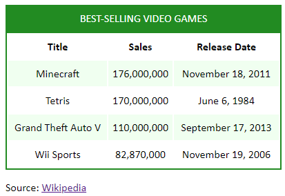

# Best Selling Video Games Table
Please Complete Below assignment and upload github link of that solution after completion
Modify styles.css so the provided HTML produces the webpage below.

Hints( Refer only if required as last option): Add the following CSS rules to styles.css:

An ID selector for the ID game-table should:

Use the border property to add a 2px solid border using the color from the CSS variable --table-color

Use the text-align property to center all text

Use a height of 200px and width of 400px

A descendant selector that targets the <caption> inside the <table> should:

Use the text-transform property to make the caption UPPERCASE

Set the background color using the CSS variable --table-color

Set the font color to white

Add 10px padding

A pseudo-class selector :nth-child(even) for <tr> should:

Set the background color using the CSS variable --row-bg-color.
